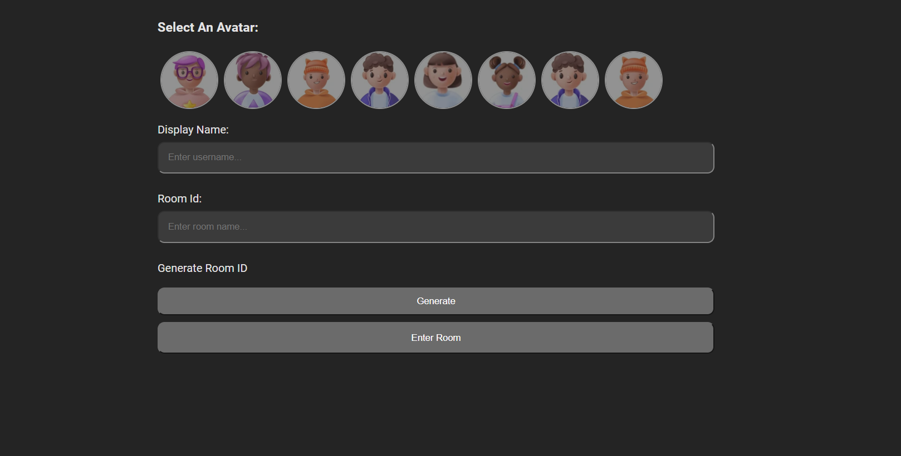
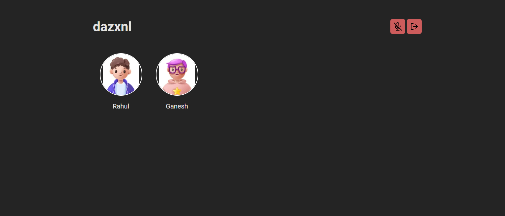

# Voice Rooms Chat App

A simple voice chat app using the Agora RTC And RTM Web SDK.

**Room**



**Lobby**



### Installation

> Ensure you have Node JS installed

```
git clone https://github.com/vladyslavstpanenko/rtc_chat_app.git

cd Voice-Chat-Rooms/demo

npm install
```

Add you APP ID Inside of `appid.js`

> NOTE: Get this from your Agora console when you initiate a new project.

```js
//appId.js
const appid = "YOU AGORA APP ID";

export default appid;
```

Start Development server

```
npm run dev
```

### Features

- Create/Join breakout rooms
- Active speaker volume indicator
- Display user names and avatars
